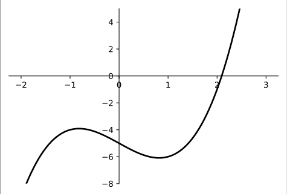

# Surprise in Newton's Method
Recall: Newton's Method, an algorithm used to estimate the roots of a differentiable function.
$$
x_n = x_{n-1} - \frac{f(x_{n-1})}{f'(x_{n-1})} \quad \text{ where } x_0 \text{ is a close value to the desired root.}
$$

## 1.1.1 The Basics of Newton's Method
  
Given the example, $f(x) = x^3 - 2x - 5$, we can deduce by the graph that there is a root approximately to the right of $x=2$.  
We can represent this difference as $\Delta x$ and can find it's approximate value by evaluating:  
$$
\begin{aligned}
    f(2 + \Delta x) &= (2 + \Delta x)^3 - 2(2 + \Delta x) - 5\\
    &= 8 + 3(2^2\Delta x) + 3(2\Delta x^2) + \Delta x^3 - 4 - 2\Delta x - 5\\
    &= -1 + 10\Delta x + 6\Delta x^2 + \Delta x^3\\
    &\approx -1 + 10\Delta x \quad \text{ as } \Delta x \text{ is already small, then exponents of } \Delta x \text{ must be  negligibly small}\\
    &\therefore \Delta x \approx \frac{1}{10}
\end{aligned}
$$

By repeating this process, where we add $\Delta$ to our solved value, we can approximate our root.  

## 1.1.2 Newton's Method in the Real Domain
We can formalize this process into the already defined Newton's method that utilizing the first derivative. 

### Example