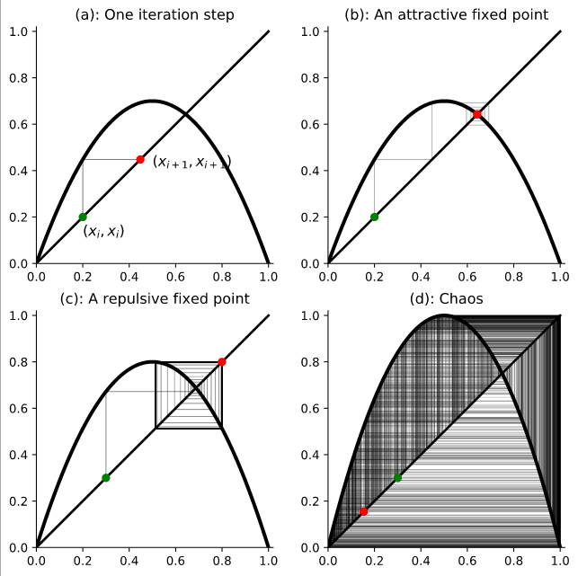

# August 29, 2023 - Intro to Chaos Theory
Starting chapter 2 in the textbook, the iteration of real numbers.

Recall: The definition of an ___orbit___.  
Some orbits don't move, they are fixed.

### Graphical Analysis:
The process of moving vertically from a point on the $y=x$ to the graph of $f$ and back to the line horizontally.  
As $(x,y)$ have the same value, we quickly create a representation of how the result of $f$ is moving.  
For this graph, we will be using the Newton's method, $N(x) = x - \frac{f(x)}{f'(x)}$.  
Sometimes called a cobweb plot.  

___Def: The Logistic Family of Functions___: Functions of the form $f_\lambda(x) = \lambda x (1-x)$ This graph is of this family of functions.  

___Attractive Fixed Point___: A function with an input that approach a definitive value upon iteration.  
___Repulsive Fixed Point___: A function with an input that moves away from a definitive value upon iteration.  
___Chaos___: We will define this specifically in the future. Note: There can be only a region of chaos.

To count the number of iterations in a cycle with this graph, we can count the points in the orbit that touch the $x$-axis. 

For the interactive version of the graph, here's a [quick link](https://marksmath.org/visualization/cobwebs).

### Tie in to Population Growth
Commonly, small populations with large resources will grow exponentially to a certain point.

For the function $f_a(x) = ax$,  
$x_0=0$ is an attractive fixed point when $|a<1|$,  
$x_0=0$ is a repulsive fixed point when $|a>1|$.

___Def: Dottie Number___: $\forall x \in \R$, if we infinitely recurse through  $cos(x)$, we approach the same value.

## 2.4 Classification of Fixed Points
Note: It is very unusual to find a closed form expression of a recursive linear function.

___Def: Affine Function___: A function $f$ of the form $f(x)=ax+b$ where $a \neq 0$.  
Note: A fixed point of an affine function is $x=\frac{b}{a-1}$.

___Definition 2.4.4___: Let $f: \R \to \R$ be continuously differentiable and suppose that $x_0 \in \R$ is a fixed point of $f$. Then we classify $x_0$ as:  
1. ___attractive___, if $0 < |f'(x_0)| < 1$.
2. ___super attractive___, if $f'(x_0) = 0$ as it converges faster than typical attractive cases.
3. ___repulsive___, if $1 <|f'(x_0)|$.
4. ___neutral___, if $|f'(x_0)| = 1$.

___Theorem 2.4.5___: Let $f:\R \in \R$ be continuously differential and suppose that $x_0 \in \R$ is a fixed point of $f$.
1. If $x_0$ is an attractive/super-attractive fixed point for $f$,  
then $\exists \epsilon > 0$ such that the orbit of $x$ under iteration of $f$ tends to $x_0$ for $\forall x \ni |x - x_0| < \epsilon$.
2. If $x_0$ is a repulsive fixed point for $f$,  
then $\exists\epsilon > 0$ such that the orbit of $x$ under iteration of $f$ tends (initially) away from $x_0$ for $\forall x \ni |x-x_0 | < \epsilon$.

Note: This type of proof will not be something on a test.