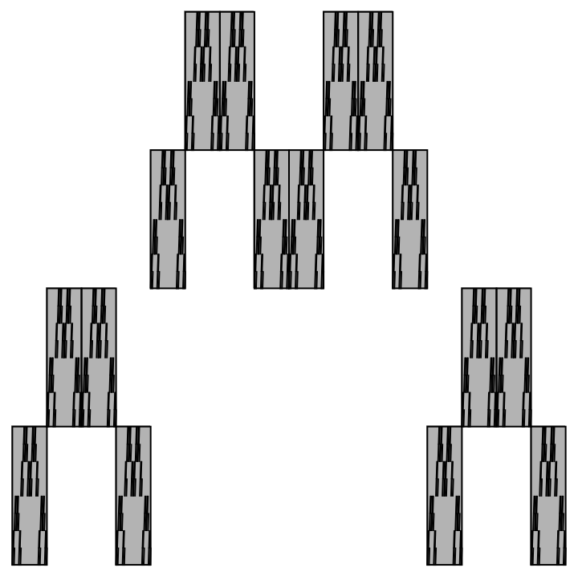

# November 20th, 2023 - More Self-Affinity
Given the following self-affine faction,

  
We can apply the box counting dimension technique to find the dimension.

$$
\begin{aligned}
\text{dim}(E)
&= \frac{\log(64)}{\log(16)} \\[1em]
&= \frac{\log(4^3)}{\log(4^2)} \\[1em]
&= \frac{3\log(4)}{2\log(4)} \\[1em]
&= \frac{3}{2}.
\end{aligned}
$$

## McMullen Carpets
To create a McMullen Carpet, we choose integers $m$ and $n$ such that $1<m<n$.  
With a unit square, we subdivide it with an $m \times n$.  
Further we denote $M$ as the number of columns where there exist's a chosen tile and $N$ as the number of rows where there exists a chosen tile.  
We denote the attractor of the fractal with $C$.  
Recall: The attractor the limit of $i$ approaching infinity where $i$ is the iteration count of the IFS.  
Then the box-counting dimension of $C$,
$$
\text{dim}(C) = \frac{\log M}{\log m} + \frac{\log{\frac{N}{M}}}{\log{n}}.
$$

Note: The fractal dimension is reliant on the placement and overlapping of elements.  
We can imagine the 

### Chaotic Assignment
With my McMullen Carpet, I have $m=3$ and $n=4$.  
Since every row and column has a chosen tile, $M=3$ and $N=4$.  
Therefore, the fractal dimension of my McMullen Carpet is,
$$
\begin{aligned}
\text{dim}(C)
&= \frac{\log(M)}{\log(m)} + \frac{\log(N/M)}{\log(n)} \\[2em]
&= \frac{\log(3)}{\log(3)} + \frac{\log(4/3)}{\log(4)} \\[2em]
&= 1 + \frac{\log(4/3)}{\log(4)} \\[2em]
&\approx 1.20751874964.
\end{aligned}
$$